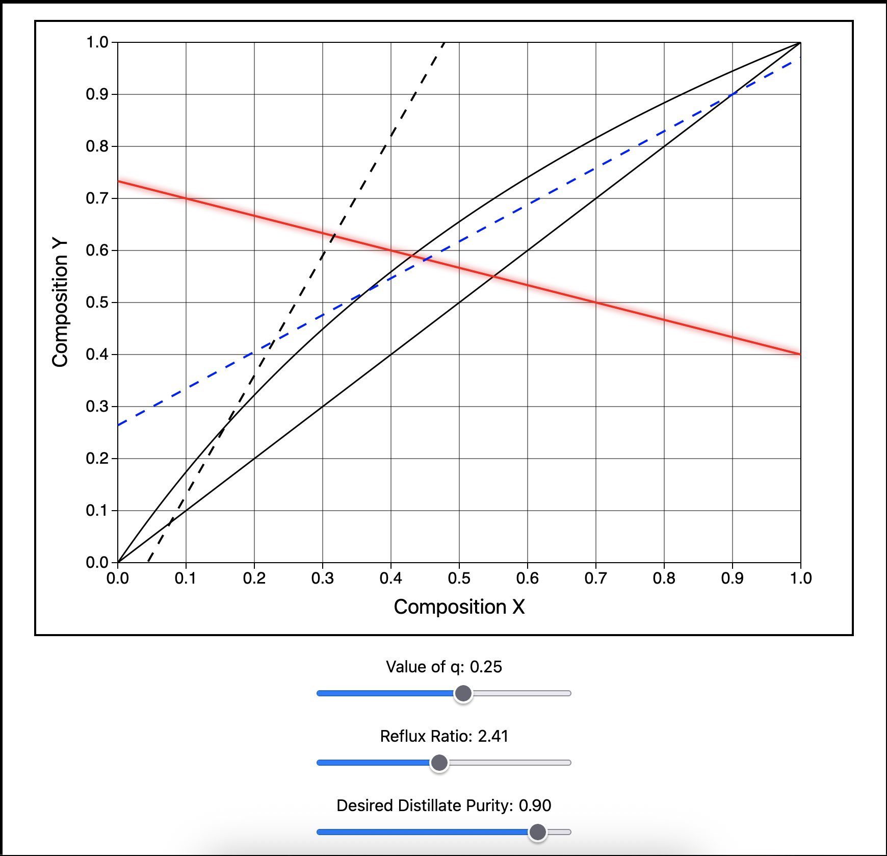

# Interactive-Distillation
This tool was created to visualise variation of parameters on a binary distillation of two components A and B made with [D3.js](https://d3js.org/). It can be viewed on the following Github Pages link [here](https://linussgi.github.io/interactive-distillation/).

The following variables can be manipulated:

- The feed condition $q$
- The reflux ratio $R$
- The desired distillate purity $x_D$

The distillation bottom operating line does not vary for the purposes of this graph, and so the number of column stages cannot be determined from this information alone.

## Theory

The graph plots 4 lines that depend on system properties:

- The top operating line (blue, dashed). Influenced by the relfux ratio and the desired distilate purity
- The bottom operating line (black, dashed). Not influenced for the purpose of this graph calculator 
- The q-line (red, solid). The feed condition for your system (elaborated on below)
- The equilibrium line (black, solid). This is a curved line that represents the VLE equilirbium of the system (often determined emprically)

### Lines plotted by the graph 

The lines displayed on these graphs are constructed from distillation equilibrium equations. The top operating line has a well known expression:

$$y_n = \frac{R}{R + 1} x_n + \frac{x_D}{R + 1}$$

- $y_n$ is the fraction of the vapour
- $R$ is the set reflux ratio
- $x_n$ is the fraction of the liquid
- $x_D$ is the desired distillate purity of the light key

Since this is a binary distillation, the fraction of component A fixes the value of the fraction of component B. In this equation, $R$ and $x_D$ can be manipulated using the sliders on the graph.

There are two sidebars with some system information relating to the feasibility and the effect (but not exact number) this will have on the number of trays required for the separation. The point of minimum reflux is also highlighted when the q-line, top operating line, and equilibrium line intersect (you can achieve this by varying the parameters).

### How to find the q-value of your system

The Q-line (feed condition) also has a well known expression:

$$y_q = \frac{-q}{1 - q} x_q + \frac{x_F}{1 - q}$$

- $q$ is the feed condition (table shown below)
- $x_F$ is the feed fraction that is liquid

Fundamentally, $q$ describes the amount of heat required by the liquid stream to become a saturated vapour. This is how to tell which feed condition we have based on:

| $q$ value   | Meaning                 |
| ----------- | ----------------------- |
| $q > 1$     | Cold Feed               |
| $q = 1$     | Bubble Point Feed       |
| $0 < q < 1$ | Quality Region Feed     |
| $q = 0$     | Dew Point Feed          |
| $q < 0$     | Superheated Vapour Feed |

The value of $q$ for your system can be computed with the following equation, which is a simple heat balance to convert the feed into:

For a Cold Feed:

$$q = 1 + \frac{C_{p_L}(T_b - T_F)}{\lambda}$$

For a super heated vapour feed:

$$q = \frac{- C_{p_V} (T_F - T_d)}{\lambda}$$ 

For a Quality Region Feed:

$$q = x_F$$

Where:

- $\lambda$ is the feed heat of vaporisation
- $C_p$ is the feed heat capacity (either liquid or vapour depending on the feed condition)
- $T_f$ and $T_d$ are the temperatures of the incoming feed and the distillation column at the feed tray respectively

### Further Information

There is room for other degrees of freedom such as:

- Reltaive volatility slider between A and B to estimate different equlibrium lines
- Feed component compositon slider (fixed at 0.55 for this tool)
- Flowrates for column sizing and trays for McCabe-Thiele method
